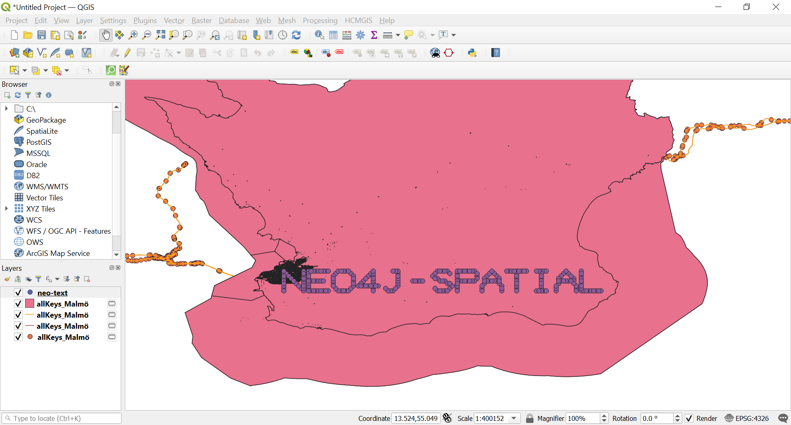
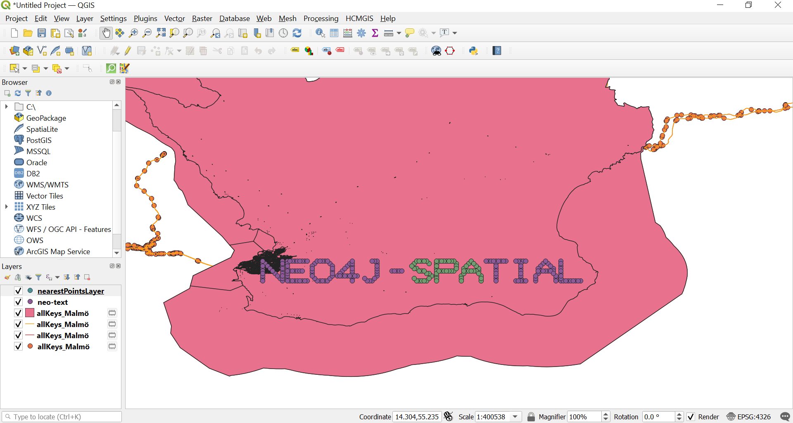

# Neo4j Spatial: Finding Things Close to Other Things

This maven project was inspired by this [blog](https://neo4j.com/blog/neo4j-spatial-part1-finding-things-close-to-other-things/).
It's an example of how to use a spacial neo4j plugin by java.

## Specification

- java : 1.8.0_261
- mvn : 3.6.3
- neo4j : 3.5.2
- neo4j spacial : 0.26.2

## What's in this examples

### FindingThingsCloseToOtherThings

In this example we import a set of coordinates into an embedded neo4j databases, the coordinates are imported into a layer with the name `neo-text`.
The coordinates in this example are situated in an era near Malmo, Sweden.
After exporting theses coordiantes into qgis, they look like this:

We executed a command of spacial neo4j `findClosestPointsTo`, this method gives us the set of points that are close of a certain given point.(in our case `13.0, 55.6`).
Here below the result points after exporting them into ggis.

### LoadOsmToNeo4j

In this example we import an osm (openstreetmap) into spacial neo4j, this allows us to manipulate the geo data as graph.

### ExportShapeFile

In this example we export a certain shape file from an osm already imported, this allows us to retrieve only a certain type of geometries like points, polygones...
